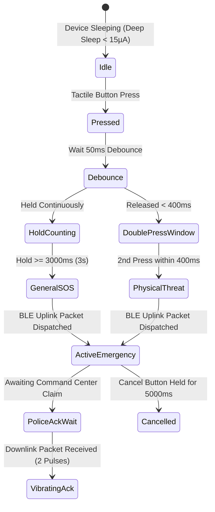

# REPORT SafeTag Hardware Integration Architecture

## 1. Executive Summary

**REPORT SafeTag** is a wearable, ultra-low-power physical panic button architecture designed to trigger emergency distress alerts without requiring a citizen to unlock, look at, or manipulate their smartphone.

This document formalizes the **ESP32 BLE GATT specification**, packet validation contracts, debounce timings, downstream police acknowledgement haptics, Android companion architecture, and future standalone cellular evolution.

---

## 2. BLE GATT Profile Specification

The ESP32 firmware operates as a BLE Peripheral advertising with custom 128-bit UUIDs:

| BLE Attribute | UUID | Type | Properties | Description |
|---|---|---|---|---|
| **Emergency Service** | `0000ffe0-0000-1000-8000-00805f9b34fb` | Primary Service | — | Core SafeTag Emergency GATT Service |
| **Trigger Characteristic** | `0000ffe1-0000-1000-8000-00805f9b34fb` | Characteristic | Notify | Uplink trigger packet from SafeTag to phone |
| **Police Ack Characteristic** | `0000ffe2-0000-1000-8000-00805f9b34fb` | Characteristic | Write / Indicate | Downlink command center confirmation to SafeTag |
| **Telemetry Characteristic** | `0000ffe3-0000-1000-8000-00805f9b34fb` | Characteristic | Read / Notify | Battery status, sequence counter, firmware version |

---

## 3. Physical Input Triggers & Timings

SafeTag minimizes false alarms while guaranteeing rapid actuation under duress through tactile hardware timings:



- **Debounce Threshold**: `50 ms`
- **Primary Long-Press (General SOS)**: `3000 ms` continuous hold
- **Rapid Double-Press (Physical Threat)**: 2 presses within `400 ms`
- **Secondary Button (Medical Emergency)**: `1000 ms` hold
- **False-Alarm Cancellation**: `5000 ms` hold within a `10000 ms` grace window

---

## 4. BLE Packet Serialization & Wire Contract

### Uplink Emergency Packet (SafeTag $\to$ Phone / Gateway)
```json
{
  "device_id": "SAFETAG-ESP32-9A4F",
  "firmware_version": "1.0.0-ESP32",
  "battery_level": 88,
  "event_type": "SOS_PHYSICAL_THREAT",
  "event_id": "f47ac10b-58cc-4372-a567-0e02b2c3d479",
  "timestamp": "2026-09-19T07:15:00.000Z",
  "sequence_number": 42
}
```

### Downlink Police Acknowledgement (Command Center $\to$ SafeTag)
```json
{
  "ack": true,
  "sos_id": "e81d4a8e-28b9-43cf-8a8b-3d60610360a0",
  "station_code": "TN-CHN-001",
  "station_name": "Adyar Police Station",
  "officer_badge": "SI-204",
  "vibration_pulses": 2,
  "vibration_pattern_ms": [300, 150, 300],
  "timestamp": "2026-09-19T07:15:35.000Z"
}
```

---

## 5. Downstream 2-Pulse Vibration Acknowledgement

When an investigating officer clicks **Claim & Acknowledge** on the Police Dashboard:
1. Supabase triggers `acknowledge_sos_secure` updating the database state to `threat_level = 'ACKNOWLEDGED'`.
2. The citizen client/companion receives the real-time event.
3. The phone sends the downlink acknowledgement payload over BLE Characteristic `0000ffe2`.
4. The SafeTag haptic motor triggers the canonical pattern:
   - **Pulse 1**: 300 ms buzz
   - **Pause**: 150 ms silence
   - **Pulse 2**: 300 ms buzz
5. In the browser simulator, this is accompanied by `navigator.vibrate([300, 150, 300])` and the badge `"2× vibration acknowledgement simulated"`.

---

## 6. Tiered Implementation Architecture

To ensure total transparency and avoid overpromising browser capabilities:

### Tier A: Web / PWA Implementation (Currently Live)
- Fully interactive **SafeTag Simulator Console** (`"SAFE TAG SIMULATOR — DEMO HARDWARE"`).
- Emits standard JSON BLE packets into the Crisis Intelligence Engine.
- Receives simulated 2-pulse haptic feedback upon police acknowledgement.
- Web Bluetooth API integration for active foreground sessions.

### Tier B: Android Companion Architecture (Production BLE)
- An Android Foreground Service using `BluetoothLeScanner`.
- Operates continuously in the background even when the phone screen is locked.
- Intercepts GATT notifications from physical SafeTag ESP32 hardware.
- Instantly queries the Android `FusedLocationProviderClient` for fresh GPS coordinates and forwards the alert over HTTPS to the REPORT Supabase endpoint.

### Tier C: Future Standalone SafeTag Device (No Phone Required)
- Dual-mode microcontroller (e.g., Nordic nRF9160 or Quectel BG95).
- Integrated GNSS satellite receiver.
- Direct cellular LTE-M / NB-IoT connectivity for standalone distress signaling in rural or outdoor environments.
