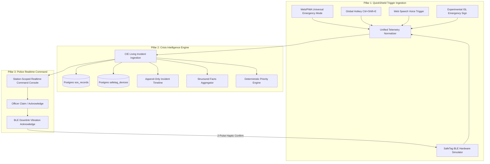

# REPORT Universal Emergency System — Architecture & Operations Manual

## 1. Executive Overview

The **REPORT Universal Emergency System** upgrades traditional, one-dimensional SOS panic buttons into an omni-channel, crisis-resilient intelligence ecosystem. It addresses the fundamental flaw of legacy SOS systems: treating an emergency as a single isolated binary ping ("help") rather than an evolving, life-threatening situation where facts change rapidly and the victim may be in close physical proximity to an assailant.

The system is built upon three foundational pillars:
1. **REPORT QuickShield**: Ultra-low-friction emergency triggering that bypasses normal navigation.
2. **REPORT Crisis Intelligence Engine (CIE)**: A real-time engine that transforms alerts into living, append-only structured incident records with deterministic priority calculation.
3. **REPORT SafeTag Hardware Integration**: An ESP32 BLE GATT peripheral protocol and browser simulator with downstream 2-pulse police acknowledgement vibration.

---

## 2. Core Architectural Pillars

---

## 3. Emergency Taxonomy & Structured Categories

To uphold strict constitutional, judicial, and ethical standards, **AI is never permitted to speculate or label any individual a "criminal", "killer", or "terrorist"**. All incidents must map to neutral, objective crisis categories:

| Category Code | Display Label | Tamil Localization | Default Threat Level | Default Priority |
|---|---|---|---|---|
| `IMMEDIATE_PHYSICAL_THREAT` | Immediate Physical Threat | உடனடி உடல் ரீதியான அச்சுறுத்தல் | `CRITICAL_THREAT` | `CRITICAL` |
| `ARMED_THREAT` | Armed Threat / Weapon Present | ஆயுத அச்சுறுத்தல் | `CRITICAL_THREAT` | `CRITICAL` |
| `HOSTAGE_OR_HOME_INVASION` | Hostage / Intrusion / Invasion | பிணைக்கைதி / அத்துமீறல் | `CRITICAL_THREAT` | `CRITICAL` |
| `KIDNAPPING_OR_ABDUCTION` | Kidnapping / Abduction | ஆள்கடத்தல் | `CRITICAL_THREAT` | `CRITICAL` |
| `DANGEROUS_PURSUIT` | Dangerous Pursuit / Stalking | பின்தொடர்தல் / துரத்துதல் | `ACTIVE_THREAT` | `HIGH` |
| `MEDICAL_EMERGENCY` | Medical Emergency / Critical Care | மருத்துவ அவசரநிலை | `ACTIVE_THREAT` | `HIGH` |
| `FIRE_OR_DISASTER` | Active Fire / Environmental Hazard | தீ விபத்து / பேரிடர் | `ACTIVE_THREAT` | `HIGH` |
| `BOMB_OR_EXPLOSIVE_THREAT` | Bomb / Explosive Threat | வெடிகுண்டு அச்சுறுத்தல் | `CRITICAL_THREAT` | `CRITICAL` |
| `SEXUAL_ASSAULT_OR_IMMEDIATE_DANGER` | Sexual Assault / Critical Distress | பாலியல் வன்கொடுமை அச்சுறுத்தல் | `CRITICAL_THREAT` | `CRITICAL` |
| `MISSING_OR_ENDANGERED_PERSON` | Missing / Endangered Person | காணாமல் போன நபர் | `ACTIVE_THREAT` | `HIGH` |
| `OTHER_CRITICAL_EMERGENCY` | Critical Emergency (General) | பொது அவசர உதவி | `ACTIVE_THREAT` | `HIGH` |

---

## 4. Deterministic Threat & Priority Formula

Priority is never computed via probabilistic LLM guessing. It is derived through a strict deterministic rule cascade:

$$\text{Priority} = \begin{cases} 
\text{CRITICAL}, & \text{if } \text{weapon\_visible} = \text{true} \lor \text{weapon\_reported} = \text{true} \\
\text{CRITICAL}, & \text{if } \text{active\_attack} = \text{true} \lor \text{hostage\_situation} = \text{true} \\
\text{CRITICAL}, & \text{if } \text{immediate\_physical\_threat} = \text{true} \\
\text{CRITICAL}, & \text{if } \text{category} \in \{\text{ARMED}, \text{HOSTAGE}, \text{BOMB}, \text{PHYSICAL\_THREAT}, \text{ABDUCTION}\} \\
\text{Category Default}, & \text{otherwise (suspects count is contextual intelligence and does not trigger CRITICAL alone)}
\end{cases}$$

---

## 5. Provenance & Non-Fabrication Standards

Every emergency event stores an immutable provenance stamp:
- `source`: Trigger channel (`WEB_QUICKSHIELD`, `SAFETAG_BLE_SIMULATOR`, `NO_COMMUNICATION_MODE`, `ADAPTIVE_INTERVIEW`, `SIGN_LANGUAGE_EXPERIMENTAL`, `POLICE_COMMAND`)
- `user_confirmed`: Boolean indicating explicit user confirmation
- `confidence`: Confidence score ($0.0 \dots 1.0$)
- `timestamp`: High-precision ISO-8601 UTC timestamp
- `location`: `{ lat, lng, accuracy }`

### Truthful SMS & Hardware Guarantees
- **Unconfigured Gateway**: When SMS credentials are absent, the system exhibits `SMS_PROVIDER_NOT_CONFIGURED` and routes the user to **Call 112 / 100**. It never fabricates an SMS delivery report.
- **Simulation Mode**: In demo environments, alerts display `"DEMO SIMULATION — No physical SMS was sent"`.
- **Hardware Architecture Truthfulness**: Web/PWA limitations are explicitly declared: background BLE triggers when phone is locked require the companion Android Foreground Service.

---

## 6. Implementation Status Matrix

| Component | Status | Description |
|---|---|---|
| **Database Migration (20260919000000)** | **APPLIED (PRODUCTION)** | Production Supabase database updated with all columns, tables, and Security Definer RPCs. |
| **QuickShield Web Hotkey & Deep Link** | **IMPLEMENTED** | `Ctrl+Shift+E`, `#quickshield`, `?sos=quickshield` globally mounted. |
| **QuickShield Web Speech Trigger** | **IMPLEMENTED** | Web Speech API listening for emergency keywords in active tabs. |
| **Universal Emergency Mode UI** | **IMPLEMENTED** | 5 rapid category buttons with high-contrast accessible touch targets. |
| **No-Communication Emergency Mode** | **IMPLEMENTED** | Silent incident creation with binary `[ NEED HELP ]` / `[ I'M SAFE ]` pings. |
| **Adaptive Emergency Interview** | **IMPLEMENTED** | 4-question progressive intelligence collector with fact merging. |
| **Crisis Intelligence Engine (CIE)** | **IMPLEMENTED** | Living incident data model, append-only timeline, deterministic priority. |
| **Police Realtime Command Alert** | **IMPLEMENTED** | Realtime incident updates, structured facts, timeline view, acknowledge/resolve. |
| **SafeTag BLE Protocol Specification** | **IMPLEMENTED** | 128-bit GATT profile, timings, debounce, and packet schema. |
| **SafeTag Browser Simulator** | **SIMULATED** | Interactive virtual tag with `"SAFE TAG SIMULATOR — DEMO HARDWARE"`. |
| **Downlink Police Ack Haptics** | **SIMULATED** | 2-pulse haptic display `"2× vibration acknowledgement simulated"`. |
| **httpSMS Demo Dispatch** | **SIMULATED** | Truthfully tagged with `[DEMO SIMULATION] — No physical SMS was sent`. |
| **Locked Phone Hardware Button Capture** | **REQUIRES ANDROID COMPANION** | Web browsers cannot listen to hardware buttons when phone is locked. |
| **Background BLE Peripheral Scanning** | **REQUIRES ANDROID COMPANION** | Android Foreground Service with `BluetoothLeScanner` required. |
| **SafeTag ESP32 Wearable Device** | **REQUIRES PHYSICAL HARDWARE** | Physical BLE tag hardware prototype. |
| **Standalone LTE-M / GNSS SafeTag** | **FUTURE** | Phone-independent cellular + satellite panic device. |

